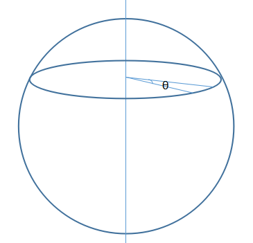

Canvas是HTML5新增的一个画布组件，提供了2D绘图环境，可以用JavaScript在上面绘制2D图形。虽然它不提供3D绘图环境，但是可以通过一些手段模拟3D效果。      
本文详细介绍用Canvas模拟简单3D旋转效果的原理及实现。          
我们知道3D有x，y，z三个坐标，而2D只有x和y，如何将三个坐标降维为两个是实现转换的关键。      
      
如上图所示，可以很明显的看到，离拍摄人近的栏杆比较大，而离得远的比较小。照片是在一个平面上的，却有三维的效果，无非就是因为近大远小。3D模拟2D，也无非就是对物体的大小以及坐标根据它在z轴方向上的坐标进行缩放。如下图所示：       
       
将观察者离显示器的距离称为焦距（focalLength），被观察物体离显示器的距离，即物体在z轴方向的坐标称为zPos。物体离显示器距离为0时为物体的原始大小，那么离显示器距离为zPos的物体，其大小及在显示器平面上的坐标缩放比为：     
```
scale = focalLength / (focalLength + zPos);
```     
本文以绘制小球为例子，用这个缩放比对小球的半径以及在显示器所在平面上的x、y坐标进行缩放，此外，为了模拟离观察者进的物体比较清晰、离得远的物体模糊的效果，对小球的透明度也进行一定处理，代码如下：        
```
var scale = focalLength / (focalLength + ball.zPos);
    ball.x = xCenter + ball.xPos * scale;
    ball.y = yCenter + ball.yPos * scale;
    ball.r = ball.R * scale;
    ball.alpha = scale;
```     
解决了3D转2D的问题，接下来看物体转动的问题，如下图所示，一个物体在任意一个平面上绕y轴转动了角度θ：     
      
将它放到一个平面上看。因为是绕y轴转动，所以y坐标不会变，只考察x和z坐标，如下图：        
         
设小球半径为r，可以列出如下式子：      
```
r * sin(θ + ɑ) = z0;
r * cos(θ + ɑ) = x0;
r * sinɑ = z;
r * cosɑ = x;
```     
解方程不难得出：     
```
x = x0 * cosθ - z0 * sinθ;
z = x0 * cosθ + x0* sinθ;
```       
到这里，旋转的原理就已经说完了。总的来说，就是先算出物体旋转一个角度θ后的三维坐标x、y、z，然后将三维坐标转为二维坐标。代码如下：     
```
function rotateY(ball, angleY) {
    var cosy = Math.cos(angleY),
        siny = Math.sin(angleY),
        x1 = ball.xPos * cosy - ball.zPos * siny,
        z1 = ball.zPos * cosy + ball.xPos * siny;
    ball.xPos = x1;
    ball.zPos = z1;

    var scale = focalLength / (focalLength + ball.zPos);
    ball.x = xCenter + ball.xPos * scale;
    ball.y = yCenter + ball.yPos * scale;
    ball.r = ball.R * scale;
    ball.alpha = scale;
}
```
小球对象的代码为：     
```
function Ball(options) {
    this.R = options.R || 100;
    this.xPos = options.xPos;
    this.yPos = options.yPos;
    this.zPos = options.zPos;
    this.alpha = 1;
    this.r = 0;
    this.x = 0;
    this.y = 0;
}

Ball.prototype = {
    constructor: Ball,
    draw: function (ctx) {
        ctx.save();
        ctx.fillStyle = 'rgba(0, 0, 0, ' + this.alpha + ')'
        ctx.beginPath();
        ctx.arc(this.x, this.y, this.r, 0, Math.PI * 2);
        ctx.fill();
        ctx.closePath();
        ctx.restore();
    }
}
```     
其中R、xPos、yPos、zPos分别指小球在三维坐标下的半径及x、y、z方向的坐标，r、x、y指转换后小球在二维坐标系下的半径及x、y坐标，此外还有透明度alpha，后面的这四个值也就是绘制时用到的值。此外，小球对象还有一个draw方法，来绘制自己。      
main.js文件中，draw方法用来擦除绘制区域，分别获取小球在旋转yAngle角度后的各个参数，然后调用小球的绘制方法。animate方法实现循环绘制的逻辑。requestAnimationFrame是requestAnimationFrame方法的一个polyfill实现。       
这里我们先实例化十个小球，然后让开始运动动画。致此，一个简单的绕y轴旋转的3D效果就实现了。

